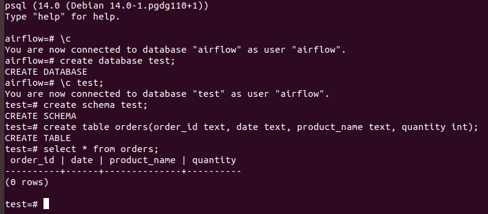
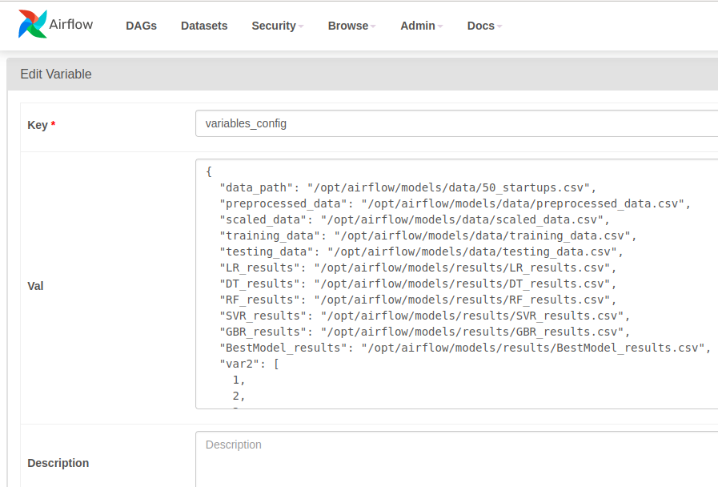
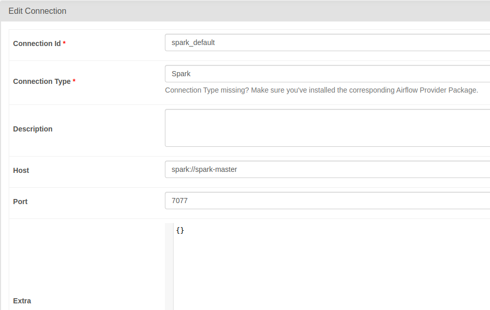
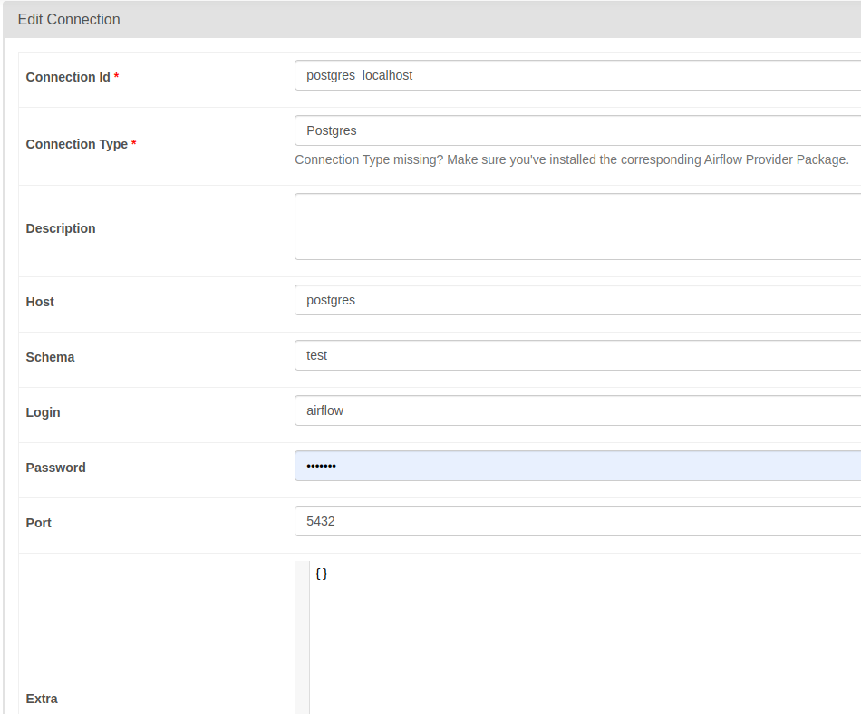
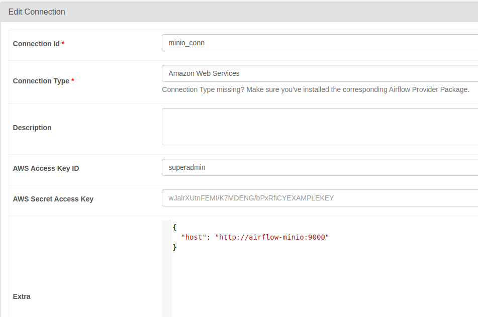

# docker-airflow-spark
Docker with Airflow + Postgres + Spark cluster + JDK (spark-submit support) + Jupyter Notebooks

## 📦 The Containers

* **airflow-webserver**: Airflow webserver and scheduler, with spark-submit support.
    * image: `hoangph3/airflow:2.6.3-extend` (custom, Spark version 3.4.1)
      * Based on [apache/airflow:2.6.3-python3.8](https://hub.docker.com/r/apache/airflow), and [puckel/docker-airflow](https://github.com/puckel/docker-airflow)
    * port: 8080

* **postgres**: Postgres database, used by Airflow.
    * image: `postgres:14.0`
    * port: 5432

* **spark-master**: Spark Master.
    * image: `hoangph3/spark:3.4.1`
    * port: 8081

* **spark-worker[-N]**: Spark workers (default number: 1). Modify docker-compose.yml file to add more.
    * image: `hoangph3/spark:3.4.1`

## 🛠 Setup

### Build airflow and spark Docker

    $ make build_airflow build_spark
  
### Launch containers

    $ docker-compose up -d

### Check accesses

* Airflow: http://localhost:8080
* Spark Master: http://localhost:8181
  
## 👣 Additional steps

### Create `test` database in postgres:

* Jump into postgres container: `docker exec -it airflow-postgres psql -U airflow`.
* In container, execute the following command line to create database:



* Copy data into postgres: `docker cp data/ airflow-postgres:/data`
* Run `python3 psql_client.py` to insert data into orders table.

### Add airflow variables

* Go to Airflow UI > Admin > Variables
* Upload variables json file.


  
### Edit connection from Airflow to Spark

* Go to Airflow UI > Admin > Edit connections
* Edit `spark_default` entry:
  * Connection Type: `Spark`
  * Host: `spark://spark-master`
  * Port: `7077`



* Edit `postgres_localhost` entry:
  * Connection Type: `Postgres`
  * Host: `postgres`
  * Schema: `test`
  * Login: `airflow`
  * Password: `airflow`
  * Port: `5432`



* Edit `minio_conn` entry:
  * Connection Type: `Amazon Web Services`
  * AWS Access Key ID: `superadmin`
  * AWS Secret Access Key: `secretpassword`
  * Extra: 
  ```
  {
    "host": "http://airflow-minio:9000"
  }
  ```




### Test spark-submit from Airflow
  
Go to the Airflow UI and run the `tutorial_spark_submit_operator` DAG :)

### Test postgres operator from Airflow
  
Go to the Airflow UI and run the `tutorial_postgres_hooks` DAG :)

### Test ml pipeline from Airflow

Go to the Airflow UI and run the `tutorial_ml_simple_pipeline` DAG :)
