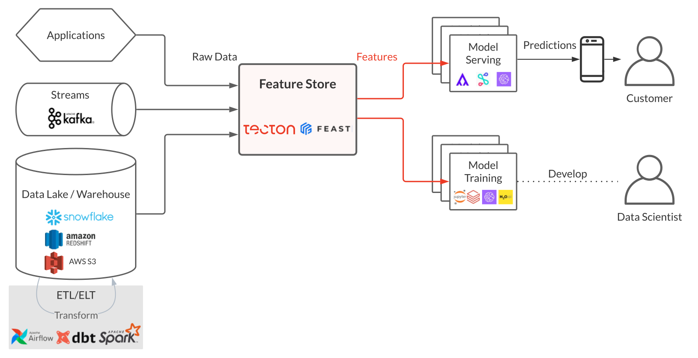

## Feature Store with Spark Streaming, Kafka, DataLake

Feature Store provides a centralized location to store and document features that will be used in machine learning models and can be shared across projects.

A Feature Store solution might address one or a combination of these problems:

- Feature management:
A feature store can help teams share and discover features, as well as manage roles and sharing settings for each feature (feature catalog).
- Feature computation:
A feature store can help with both performing feature computation and storing the results of this computation (data warehouse).
- Feature consistency:
A key selling point of modern feature stores is that they unify the logic for both batch features and streaming features, ensuring the consistency between features during training and features during inference.

