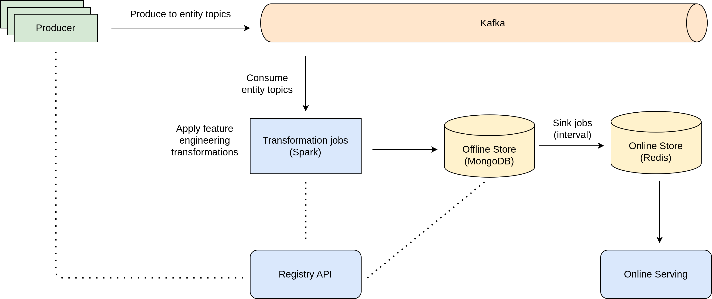
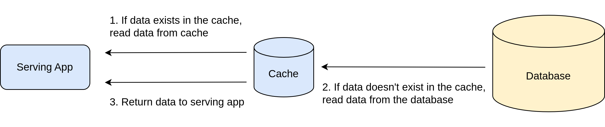

## Feature Store proposed architecture



The solution currently implemented contains only the following components:

- Producer: applications producing entities to the kafka.
- Registry: repository of the schemas created on the pipeline stages.
- Kafka: streaming platform used to enable spark jobs to transform the entities produced by applications into features used by ML models. a high-performance data pipeline.
- Transformations: spark jobs to transform the entities produced by applications into features used by ML models. (User defined functions).
- Sinks: application that syncs the offline feature to the online store.
- Redis: in-memory data structure store, used as an online storage layer (caching).



1. Deploy:
```sh
make start
```

2. Produce logs to kafka:
```sh
make produce
```

3. Sink jobs:
```sh
make sink
```

4. Access the UI:
* [Kafdrop ui](http://localhost:9000)
* [Transformations spark ui](http://localhost:4040/StreamingQuery)
* [Mongodb ui](http://localhost:8081)
* [Redis ui](http://localhost:8082)

5. Clean:
```sh
make clean
```