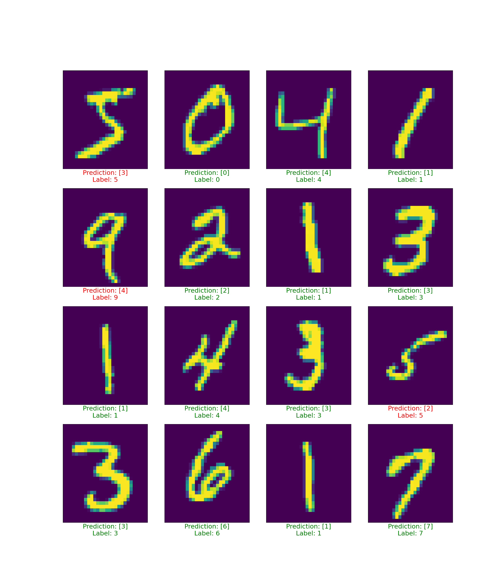

# Serving a custom model

The mlserver package comes with inference runtime implementations for `scikit-learn` and `xgboost` models. However, some times we may also need to roll out our own inference server, with custom logic to perform inference. To support this scenario, MLServer makes it really easy to create your own extensions, which can then be containerised and deployed in a production environment.

## Overview

In this example, we will train a tensorflow model. Out of the box, mlserver doesn't provide an inference runtime for tensorflow. However, through this example we will see how easy is to develop our own.

## Training

### Prepare data

Download [MNIST](https://github.com/golbin/TensorFlow-MNIST/tree/master/mnist/data) dataset, then extracting into data directory by command:

```sh
gzip -d train-images-idx3-ubyte.gz
gzip -d train-labels-idx1-ubyte.gz
```

### Training our model

```sh
python3 train.py
```

```
Epoch 4/5
100/100 [==============================] - 6s 63ms/step - loss: 1.7229 - accuracy: 0.7255
Epoch 5/5
100/100 [==============================] - 8s 78ms/step - loss: 1.4595 - accuracy: 0.7819
INFO:root:Saving the trained model to: ./models/latest
WARNING:absl:Found untraced functions such as _jit_compiled_convolution_op while saving (showing 1 of 1). These functions will not be directly callable after loading.
INFO:tensorflow:Assets written to: ./models/latest/assets
INFO:tensorflow:Assets written to: ./models/latest/assets
```

## Serving our model

```sh
mlserver start models
```

```
2023-07-26 00:31:04,926 [mlserver.grpc] INFO - gRPC server running on http://0.0.0.0:9081
INFO:     Application startup complete.
INFO:     Uvicorn running on http://0.0.0.0:9080 (Press CTRL+C to quit)
INFO:     Uvicorn running on http://0.0.0.0:9082 (Press CTRL+C to quit)
2023-07-26 00:31:05.188780: I tensorflow/tsl/cuda/cudart_stub.cc:28] Could not find cuda drivers on your machine, GPU will not be used.
2023-07-26 00:31:05.239173: I tensorflow/tsl/cuda/cudart_stub.cc:28] Could not find cuda drivers on your machine, GPU will not be used.
2023-07-26 00:31:05.239651: I tensorflow/core/platform/cpu_feature_guard.cc:182] This TensorFlow binary is optimized to use available CPU instructions in performance-critical operations.
To enable the following instructions: AVX2 FMA, in other operations, rebuild TensorFlow with the appropriate compiler flags.
2023-07-26 00:31:06.079638: W tensorflow/compiler/tf2tensorrt/utils/py_utils.cc:38] TF-TRT Warning: Could not find TensorRT
Model: "sequential"
_________________________________________________________________
 Layer (type)                Output Shape              Param #   
=================================================================
 reshape (Reshape)           (None, 28, 28, 1)         0         
                                                                 
 conv2d (Conv2D)             (None, 26, 26, 32)        320       
                                                                 
 flatten (Flatten)           (None, 21632)             0         
                                                                 
 dense (Dense)               (None, 128)               2769024   
                                                                 
 dense_1 (Dense)             (None, 10)                1290      
                                                                 
=================================================================
Total params: 2770634 (10.57 MB)
Trainable params: 2770634 (10.57 MB)
Non-trainable params: 0 (0.00 Byte)
_________________________________________________________________
2023-07-26 00:31:07,452 [mlserver] INFO - Loaded model 'mnist' succesfully.
INFO:mlserver:Loaded model 'mnist' succesfully.
2023-07-26 00:31:07,453 [mlserver] INFO - Loaded model 'mnist' succesfully.
```

## Testing

```sh
python3 test.py
```

```
{'model_name': 'mnist', 'id': 'f4ce4cfd-04fa-406f-a360-676ef0cfd925', 'parameters': {}, 'outputs': [{'name': 'output-0', 'shape': [16, 1], 'datatype': 'INT64', 'parameters': {'content_type': 'np'}, 'data': [3, 0, 4, 1, 4, 2, 1, 3, 1, 4, 3, 2, 3, 6, 1, 7]}]}
```


