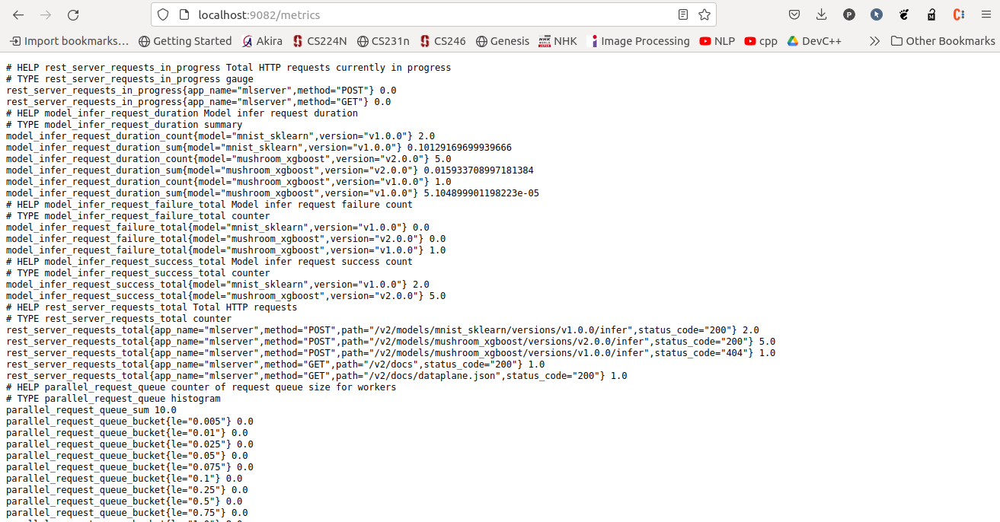
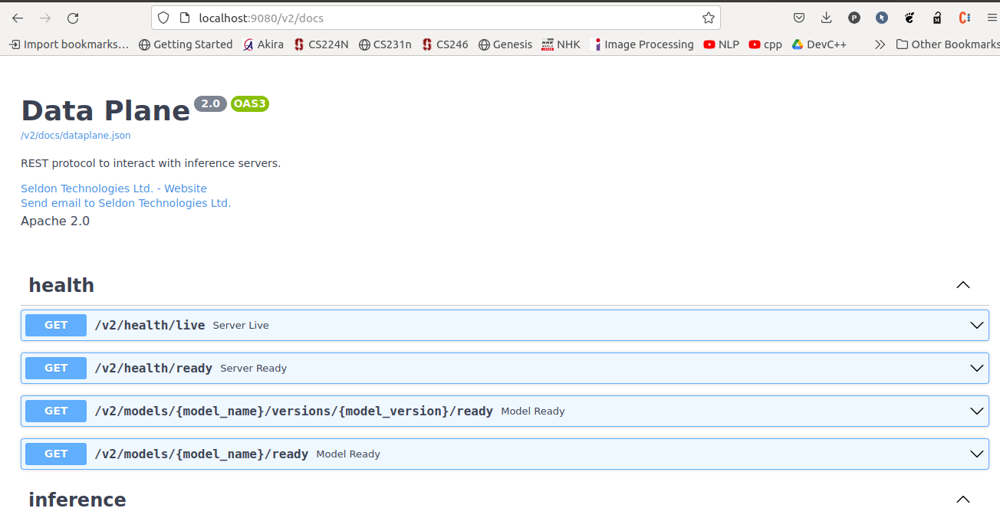

# Multi-Model Serving

MLServer has been built with [Multi-Model Serving (MMS)](https://www.seldon.io/what-is-multi-model-serving-and-how-does-it-transform-your-ml-infrastructure) in mind.
This means that, within a single instance of MLServer, you can serve multiple models under different paths.
This also includes multiple versions of the same model.

This notebook shows an example of how you can leverage MMS with MLServer.

## Requirements

Install packages dependencies:

```
python3 -m pip install mlserver mlserver-sklearn mlserver-xgboost
```

## Training

We will first start by training 2 different models:

| Name               | Framework      | Source                                                                                                                                              | Trained Model Path          |
| ------------------ | -------------- | --------------------------------------------------------------------------------------------------------------------------------------------------- | --------------------------- |
| `mnist_sklearn`        | `scikit-learn` | [MNIST example from the `scikit-learn` documentation](https://scikit-learn.org/stable/auto_examples/classification/plot_digits_classification.html) | `./models/mnist_sklearn/model.joblib`        |
| `mushroom_xgboost` | `xgboost`      | [Mushrooms example from the `xgboost` Getting Started guide](https://xgboost.readthedocs.io/en/latest/get_started.html#python)                      | `./models/mushroom_xgboost/model.json` |


### Training our model

```sh
python3 trainer/mnist_sklearn.py
python3 trainer/mushroom_xgboost.py
```

## Serving

The next step will be serving both our models within the same MLServer instance.
For that, we will just need to create a `model-settings.json` file local to each of our models and a server-wide `settings.json`.
That is,

- `settings.json`: holds the configuration of our server (e.g. ports, log level, etc.).
- `models/mnist_sklearn/model-settings.json`: holds the configuration specific to our `mnist_sklearn` model (e.g. input type, runtime to use, etc.).
- `models/mushroom_xgboost/model-settings.json`: holds the configuration specific to our `mushroom_xgboost` model (e.g. input type, runtime to use, etc.).

### `settings.json`

```python
%%writefile settings.json
{
    "debug": "true",
    "http_port": 9080,
    "grpc_port": 9081,
    "metrics_port": 9082
}
```

### `models/mnist-svm/model-settings.json`


```python
%%writefile models/mnist_sklearn/model-settings.json
{
    "name": "mnist_sklearn",
    "implementation": "mlserver_sklearn.SKLearnModel",
    "parameters": {
        "version": "v1.0.0"
    }
}
```

### `models/mushroom-xgboost/model-settings.json`


```python
%%writefile models/mushroom_xgboost/model-settings.json
{
    "name": "mushroom_xgboost",
    "implementation": "mlserver_xgboost.XGBoostModel",
    "parameters": {
        "uri": "./model.json",
        "version": "v2.0.0"
    }
}
```

### Start serving our model

Now that we have our config in-place, we can start the server. This needs to either be ran from the same directory where our config files are or pointing to the folder where they are.

```shell
mlserver start .
```

```
2023-07-25 23:05:15,731 [mlserver.parallel] DEBUG - Starting response processing loop...
2023-07-25 23:05:15,732 [mlserver.rest] INFO - HTTP server running on http://0.0.0.0:9080
INFO:     Started server process [24741]
INFO:     Waiting for application startup.
2023-07-25 23:05:15,755 [mlserver.metrics] INFO - Metrics server running on http://0.0.0.0:9082
2023-07-25 23:05:15,755 [mlserver.metrics] INFO - Prometheus scraping endpoint can be accessed on http://0.0.0.0:9082/metrics
INFO:     Started server process [24741]
INFO:     Waiting for application startup.
INFO:     Application startup complete.
2023-07-25 23:05:16,447 [mlserver.grpc] INFO - gRPC server running on http://0.0.0.0:9081
INFO:     Application startup complete.
INFO:     Uvicorn running on http://0.0.0.0:9080 (Press CTRL+C to quit)
INFO:     Uvicorn running on http://0.0.0.0:9082 (Press CTRL+C to quit)
/home/hoang/.local/lib/python3.8/site-packages/xgboost/sklearn.py:782: UserWarning: Loading a native XGBoost model with Scikit-Learn interface.
  warnings.warn("Loading a native XGBoost model with Scikit-Learn interface.")
2023-07-25 23:05:17,216 [mlserver] INFO - Loaded model 'mushroom_xgboost' succesfully.
2023-07-25 23:05:17,219 [mlserver] INFO - Loaded model 'mushroom_xgboost' succesfully.
/home/hoang/.local/lib/python3.8/site-packages/sklearn/base.py:347: InconsistentVersionWarning: Trying to unpickle estimator SVC from version 1.0.2 when using version 1.3.0. This might lead to breaking code or invalid results. Use at your own risk. For more info please refer to:
https://scikit-learn.org/stable/model_persistence.html#security-maintainability-limitations
  warnings.warn(
2023-07-25 23:05:17,258 [mlserver] INFO - Loaded model 'mnist_sklearn' succesfully.
2023-07-25 23:05:17,259 [mlserver] INFO - Loaded model 'mnist_sklearn' succesfully.
```

Since this command will start the server and block the terminal, waiting for requests, this will need to be ran in the background on a separate terminal.

## Testing

By this point, we should have both our models getting served by MLServer.
To make sure that everything is working as expected, let's send a request from each test set.

For that, we can use the Python types that the `mlserver` package provides out of box, or we can build our request manually.

### Testing our model


```sh
python3 test.py --model mnist_sklearn --version v1.0.0
```
```
{'model_name': 'mnist_sklearn', 'model_version': 'v1.0.0', 'id': '43139df6-3ca7-4ec5-9de3-e7cfe891537b', 'parameters': {}, 'outputs': [{'name': 'predict', 'shape': [1, 1], 'datatype': 'INT64', 'parameters': {'content_type': 'np'}, 'data': [4]}]}
```

```sh
python3 test.py --model mushroom_xgboost --version v2.0.0
```
```
{'model_name': 'mushroom_xgboost', 'model_version': 'v2.0.0', 'id': '78635bc6-b14c-4010-9358-88cf5eef76c1', 'parameters': {}, 'outputs': [{'name': 'predict', 'shape': [1, 1], 'datatype': 'FP32', 'parameters': {'content_type': 'np'}, 'data': [0.28583016991615295]}]}
```

## [Prometheus](http://localhost:9082/metrics)

MLServer exposes metrics that can be scraped by Prometheus.



## [Swagger](http://localhost:9080/v2/docs)

MLServer includes an autogenerated Swagger UI which can be used to interact dynamically with the Open Inference Protocol.



### List available models

Now that we've got our inference server up and running, and serving 2 different models, we can start using the Model Repository API.
To get us started, we will first list all available models in the repository.

```sh
curl --header "Content-Type: application/json" --request POST --data '{}' http://localhost:9080/v2/repository/index | json_pp
```

```
[
   {
      "state" : "READY",
      "name" : "mushroom_xgboost",
      "reason" : "",
      "version" : "v2.0.0"
   },
   {
      "state" : "READY",
      "name" : "mnist_sklearn",
      "version" : "v1.0.0",
      "reason" : ""
   }
]
```

As we can, the repository lists 2 models (i.e. `mushroom_xgboost` and `mnist_sklearn`). Note that the state for both is set to READY. This means that both models are loaded, and thus ready for inference.

### Unloading our `mushroom_xgboost` model

We will now try to unload one of the 2 models, `mushroom_xgboost`. This will unload the model from the inference server but will keep it available on our model repository.

```sh
curl --header "Content-Type: application/json" --request POST http://localhost:9080/v2/repository/models/mushroom_xgboost/unload
```

If we now try to list the models available in our repository, we will see that the `mushroom_xgboost` model is flagged as `UNAVAILABLE`. This means that it’s present in the repository but it’s not loaded for inference.

```sh
curl --header "Content-Type: application/json" --request POST --data '{}' http://localhost:9080/v2/repository/index | json_pp
```

```
[
   {
      "version" : "v2.0.0",
      "state" : "UNAVAILABLE",
      "name" : "mushroom_xgboost",
      "reason" : ""
   },
   {
      "reason" : "",
      "state" : "READY",
      "version" : "v1.0.0",
      "name" : "mnist_sklearn"
   }
]
```

### Loading our `mushroom_xgboost` model back

We will now load our model back into our inference server.

```sh
curl --header "Content-Type: application/json" --request POST http://localhost:9080/v2/repository/models/mushroom_xgboost/load
```

If we now try to list the models again, we will see that our `mushroom_xgboost` is back again, ready for inference.

```sh
curl --header "Content-Type: application/json" --request POST --data '{}' http://localhost:9080/v2/repository/index | json_pp
```

```
[
   {
      "state" : "READY",
      "name" : "mushroom_xgboost",
      "version" : "v2.0.0",
      "reason" : ""
   },
   {
      "reason" : "",
      "state" : "READY",
      "name" : "mnist_sklearn",
      "version" : "v1.0.0"
   }
]
```